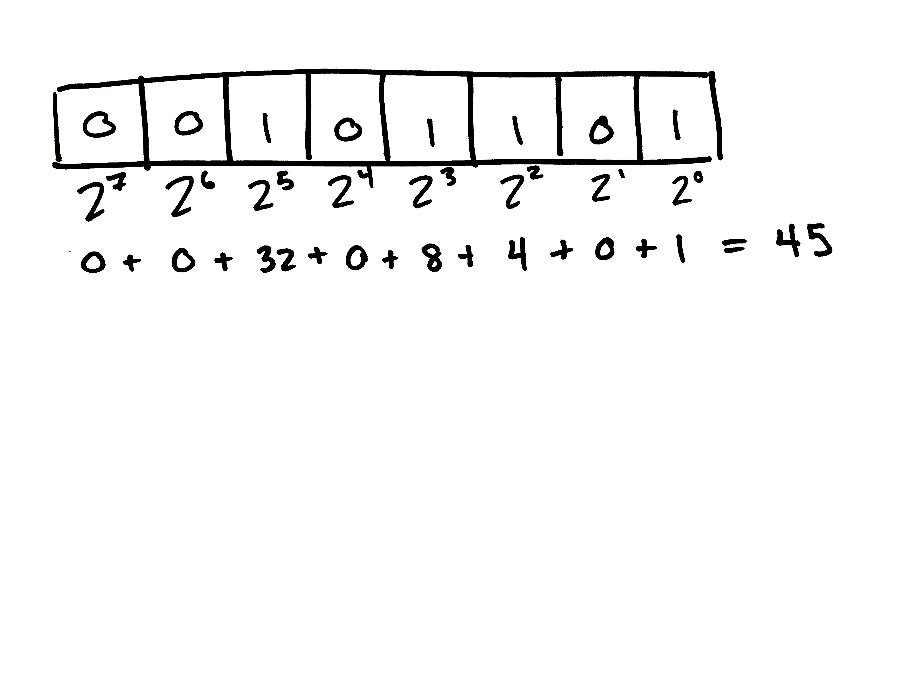
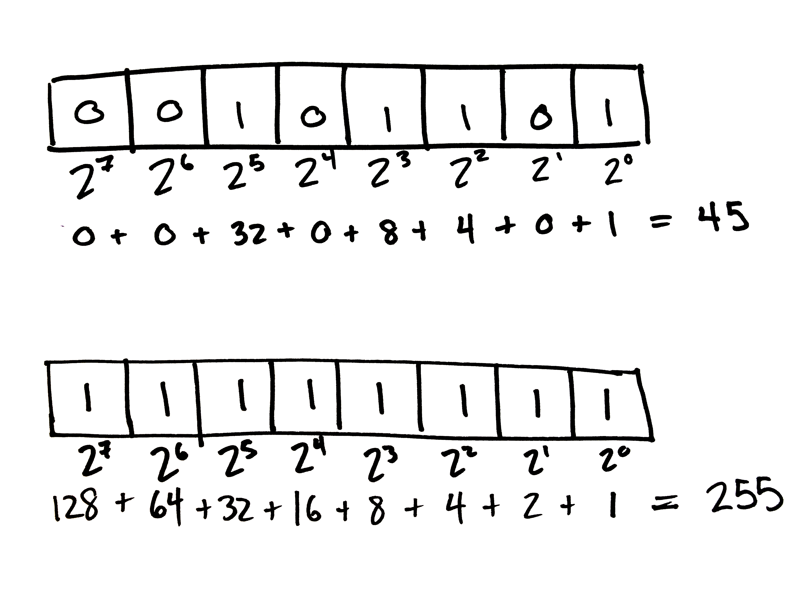
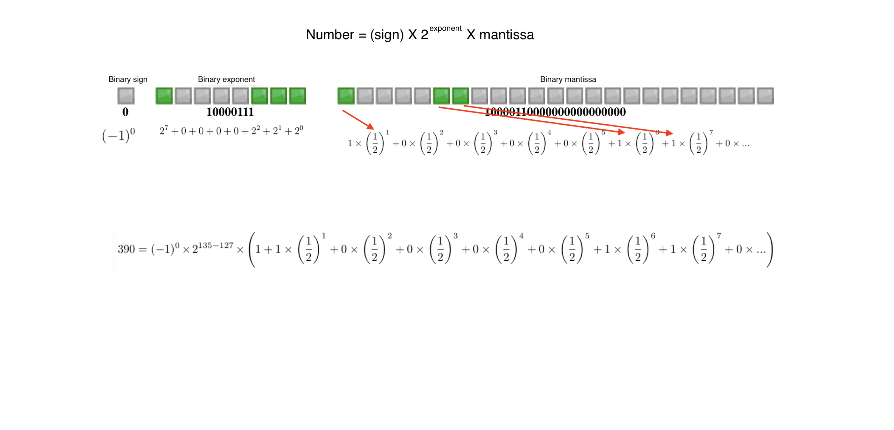
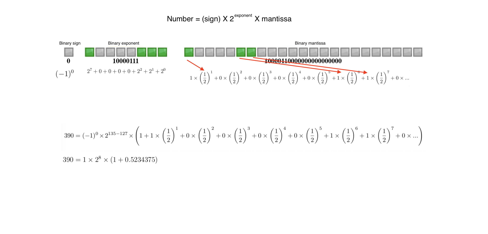

<br>
<br>
<br>

# An aside on binary representations.

---

## Binary


notes:
Who can tell me what decimal number these binary digits represent?

---

## Binary



notes:
2 to each exponent is flipped on or off, then the on-values are added together.

---

## Binary


notes:
Who can tell me what these digits represent in decimal?

---

## Binary



notes:
Computers use electrical current to turn millions of switches called "bits" on or off. They combine 8 bits together like this to make a "byte". 

---

```

390,1.83970e-003,-4.53930e-004,1.21520e-002
```

If we assume ASCII encoding, this becomes:

| | | |
|-|-|-|
|"390" <!-- .element: class="table-hl" --> |51 |57 |48 |
<!-- .element: style="margin-left: 0.2em;" -->


notes:
A string is not a number, but a list of characters. A character is a symbol represented by a unique byte as described in the ASCII table.

---

```

390,1.83970e-003,-4.53930e-004,1.21520e-002
```

If we assume ASCII encoding, this becomes:

| | | |
|-|-|-|
|"390" <!-- .element: class="table-hl" --> |51 |57 |48 |
<!-- .element: style="margin-left: 0.2em;" -->

Breaking this further down, we encode each character:

||||||||||
|-|-|-|-|-|-|-|-|-|
|51 <!-- .element: class="table-hl" --> | 0 | 0 | 1 | 1 | 0 | 0 | 1 | 1 |
|57 <!-- .element: class="table-hl" --> | 0 | 0 | 1 | 1 | 1 | 0 | 0 | 1 |
|48 <!-- .element: class="table-hl" --> | 0 | 0 | 1 | 1 | 0 | 0 | 0 | 0 |
<!-- .element: style="margin-left: 0.2em;" -->

---

```

390,1.83970e-003,-4.53930e-004,1.21520e-002
```

Then a string-to-float function translates the string "390" into a floating point number.

For a 32-bit, single-precision floating point number in the computer this looks like:


notes:
This is how our example would be stored as an IEEE754 Single precision 32-bit float. This IEEE standard for encoding floats tries to optimize for very small and very large numbers, with the understanding that computers cannot store infinite accuracy.

---


---


---


---


---



---



---
```

390,1.83970e-003,-4.53930e-004,1.21520e-002
```

|||||||||||||
|-|-|-|-|-|-|-|-|-|-|-|-|
| "1.83970e-03" <!-- .element: class="table-hl" -->| 49 | 46 | 56 | 51 | 57 | 55 | 48 | 101 | 45 | 48 | 51 |
<!-- .element: style="margin-left: 0.2em;"-->

And this is translated into a floating pointer number as well:


notes:
Point being, reading a CSV file is pretty processor intensive - so it's not a great format for huge datasets.
