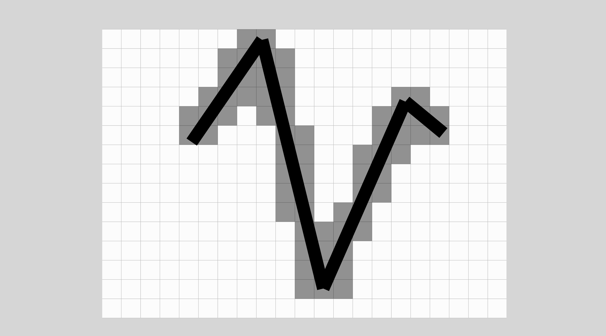
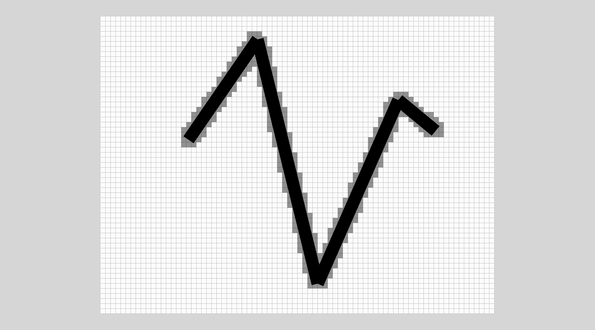
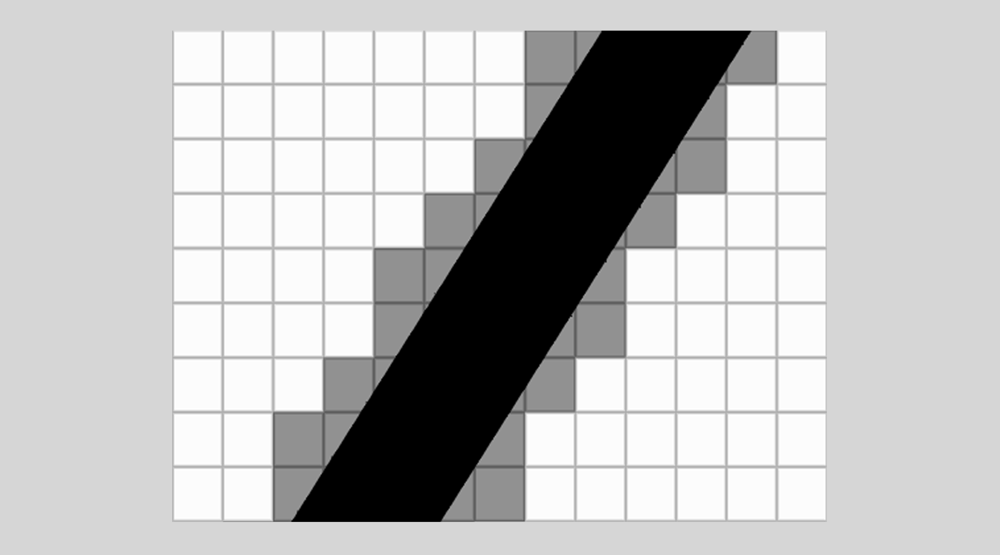

<br>
<br>
<br>

# Bureaucracy, Redux

---

## How to get help

Jill P. Naiman - `jnaiman@illinois.edu`
 * Office Hours: Tuesdays, 10:30am-12pm (online)

TA: Guangchun Zheng  - `gzheng6@illinois.edu`
 * Office Hours: Mondays 8am-10am, Thursdays 4-6pm, Fridays 5-7pm (online)

See [Zoom Meeting Room on Canvas](https://canvas.illinois.edu/courses/52731/external_tools/327) to access meeting links.

 
Other: 
 * Slack, email

---

## Where resources are be located

 * Canvas: https://canvas.illinois.edu/courses/52731 - where the grades and assignments links will be posted
 
 * PrairieLearn: https://us.prairielearn.com/pl/course_instance/170200 - where assignments will be completed

 * Course webpage: https://uiuc-ischool-dataviz.github.io/is445_obuobg_spring2025/ - where lecture slides, notebooks, data & general course info will live.

 * Slack: https://is445obuobgsp-hnm6590.slack.com/ (workspace name is is445-obuobg-spring2025) - the best place to ask questions in a `#homeworkX-questions` channel (or the `#general` channel for general questions)
 
notes:

A few notes about this semester -- while assignments will be posted on Canvas, the actual completion of the assignments will take place on the PrairieLearn platform.  We will discuss this in more detail when we get to looking at homework stuff, but in short these will be "online" cloud notebooks that have all the packages you need already installed so you don't have to install (too many) things on your local machine

Also, we will be utilizing Slack for discussing homeworks with a dedicated channel for each assignment. Again, more on this when we get to looking at the homework (as part of your homework is to say hi on slack!)

---

## Last week


notes:
last week we covered the data management and practical programming aspects of data viz

---

## Today


notes:
this week we will talk about how we can encode information about our data into visual ques

we'll focus mostly on color for this lecture but we'll briefly touch on a few other things.

--- 

<br>
<br>
<br>

# Let's consider image (spatial) data.

How is this the same/different from tabular data?

notes:
image data is an excellent example of data where the orientation of each element is important -- i.e. how we display things in space is not a choice that is really up to us, its up to the data!

---

<!-- .slide: data-background-image="images/stitch_nobg_tilted.png" data-background-size="contain"-->

notes:
how is this dataset "fundamentally" different than a tabular dataset?

---

## Does reordering tables & columns matter?

<!-- .slide: class="two-floating-elements" -->

<div class="left">


</div>

<div class="right">


</div>

notes: what happens if I re-order the rows of this table?

Or columns?

Is information lost or confused?

---

## Does reordering tables & columns matter?

<!-- .slide: class="two-floating-elements" -->

<div class="left">


</div>

<div class="right">


</div>

notes: 
with data that is inherently spatial in nature, we see we lose information and can potentially confuse our viewer if we shuffle data location and order.

---

## Does reordering tables & columns matter?

<!-- .slide: class="two-floating-elements" -->

<div class="left">


</div>

<div class="right">


</div>

We'll start with manipulating image data and then move on to geographical (GIS/spatial) data in a few lectures.

notes: 
with data that is inherently spatial in nature, we see we lose information and can potentially confuse our viewer if we shuffle data location and order.

---

<br>
<br>
<br>

# Raster vs. Vector representations of image data

notes:
generally, we'll be in charge of *making* images from data and not using images as data themselves, but it is worth spending some time thinking about how images are actually represented on a computer.

---

## Let's draw a line.

<!-- .slide: data-background-image="images/raster_vs_vector/line.svg" data-background-size="auto 65%" data-background-position="right 10% bottom 50%"-->

---

## Let's draw a line.

<!-- .slide: data-background-image="images/raster_vs_vector/line.svg" data-background-size="auto 65%" data-background-position="right 10% bottom 50%"-->

```
start = (x0, y0)
end   = (x1, y1)
width = 1.0
```
<!-- .element: class="left_abs" style="width: 50%"-->

notes:
you can see a line is basically 5 bytes in memory - one byte for each integer end point coordinate, and one byte for the width.

---

## Let's draw a line.

Convert to an 8x8 image.

<!-- .slide: data-background-image="images/raster_vs_vector/line_grid.svg" data-background-size="auto 65%" data-background-position="right 10% bottom 50%"-->

notes: so, if we map this line to an image, we see that we lose a bit of information - the graphic becomes pixelated

---

## Let's draw a line.

Convert to an 8x8 image.

<!-- .slide: data-background-image="images/raster_vs_vector/line_grid_fill.svg" data-background-size="auto 65%" data-background-position="right 10% bottom 50%"-->

notes:
this is how that line would look in a pixel representation

---

## Let's draw a line.

Convert to an 16x16 image.

<!-- .slide: data-background-image="images/raster_vs_vector/line_grid_fine2.svg" data-background-size="auto 65%" data-background-position="right 10% bottom 50%"-->

---

## Let's draw a line.

Convert to an 16x16 image.

<!-- .slide: data-background-image="images/raster_vs_vector/line_grid_fine2_fill.svg" data-background-size="auto 65%" data-background-position="right 10% bottom 50%"-->

---

## Let's draw a line.

Convert to an 32x32 image.

<!-- .slide: data-background-image="images/raster_vs_vector/line_grid_fine4.svg" data-background-size="auto 65%" data-background-position="right 10% bottom 50%"-->

---

## Let's draw a line.

Convert to an 32x32 image.

<!-- .slide: data-background-image="images/raster_vs_vector/line_grid_fine4_fill.svg" data-background-size="auto 65%" data-background-position="right 10% bottom 50%"-->

notes: so we see our pixelation gets less and less sever if we increase the number of pixels in our image

---

## Representations

We will concern ourselves with understanding two representations of an image:
the **raster** representation and the **vector** representation.

---

## Representations: raster

 * Each pixel is represented as a color (encoded by something like RGB)

notes: there are other encodings like HSV

---

## Representations: raster

 * Each pixel is represented as a color (encoded by something like RGB)
 * Common file formats such as GIF, JPG, PNG

---

## Representations: raster

 * Each pixel is represented as a color (encoded by something like RGB)
 * Common file formats such as GIF, JPG, PNG
 * Compression can be lossy (JPG) or lossless (PNG)
 * Common Editors: Paint, Photoshop

---

## Representations: raster

 * Each pixel is represented as a color (encoded by something like RGB)
 * Common file formats such as GIF, JPG, PNG
 * Compression can be lossy (JPG) or lossless (PNG)
 * Common Editors: Paint, Photoshop

In a raster image, you describe precisely what to display at each pixel.

---

## Representations: vector

 * Each component is defined as a "drawing" component, or some action to be
   taken by the rendering engine.  This can include paths, patterns,
   shapes, and text.  Components have properties associated with them.

---

## Representations: vector

 * Each component is defined as a "drawing" component, or some action to be
   taken by the rendering engine.  This can include paths, patterns,
   shapes, and text.  Components have properties associated with them.
 * Common file formats are SVG, PDF, EPS

---

## Representations: vector

 * Each component is defined as a "drawing" component, or some action to be
   taken by the rendering engine.  This can include paths, patterns,
   shapes, and text.  Components have properties associated with them.
 * Common file formats are SVG, PDF, EPS
 * The display does not exist until it is "rendered."

---

## Representations: vector

 * Each component is defined as a "drawing" component, or some action to be
   taken by the rendering engine.  This can include paths, patterns,
   shapes, and text.  Components have properties associated with them.
 * Common file formats are SVG, PDF, EPS
 * The display does not exist until it is "rendered."
 * Options for compression include (lossless) text compression, although
   the rendering engine can simplify display

---

## Representations: vector

 * Each component is defined as a "drawing" component, or some action to be
   taken by the rendering engine.  This can include paths, patterns,
   shapes, and text.  Components have properties associated with them.
 * Common file formats are SVG, PDF, EPS
 * The display does not exist until it is "rendered."
 * Options for compression include (lossless) text compression, although
   the rendering engine can simplify display
 * Common Editors: Illustrator, Inkscape

---

## Representations

Vector: 1 line (uncompressed, single precision)</br> 
 * x0, y0, x1, y1, width </br>
 * 5 bytes </br>
 * 40 bits </br>

---

## Representations

Vector: 1 line (uncompressed, single precision)</br> 
 * x0, y0, x1, y1, width </br>
 * 5 bytes </br>
 * 40 bits </br>

Raster: 1 pixel (uncompressed, singe bit-depth)</br>
 * 1 bit

---

## Representations

Vector: 1 line (uncompressed, single precision)</br> 
 * x0, y0, x1, y1, width </br>
 * 5 bytes </br>
 * 40 bits </br>

Raster: 1 pixel (uncompressed, singe bit-depth)</br>
 * 1 bit

If a line covers fewer than 40 pixels, raster is less memory than vector

notes:
keep in mind, compression algorithms can make these comparisons a little fuzzier

---

## Representations



notes:
in this image, all the lines ARE less than 40 pixels

so, in this case raster is less memory than vector

---

## Representations



notes:
but in this image, the lines aren't. What's the difference? 

The difference is the ratio of the size of the lines to the raster resolution.

---

## Representations



notes:
and now we're back to less than 40 pixels per line. But what changed? Not the resolution.

Now most of the line goes off the screen. We haven't changed the coordinates, we've just zoomed in.

Raster data discards any information outside of the domain. Vector data preserves all information, regardless of boundaries.

so, for example, if you have a PDF document you can often times do "infinity zooming in" and STILL see sharp outlines of pictures/text.  But if its 
a raster representation zooming in will make things look "pixelated" at some point.

---

## Raster Representation

| | | | | |
|-:|-|-|-|-|
| | 1 Line | 10 Lines | 1000 Lines | 1e6 Lines |
| &nbsp; &nbsp; &nbsp; `600x600` | 45kb &nbsp; | 45kb | 45kb | 45kb |

notes: lets look at a few examples - for a 600x600 pixel image, we have to define data
at each pixel, reguardless if we have a line there or not...

---

## Raster Representation

| | | | | |
|-:|-|-|-|-|
| | 1 Line | 10 Lines | 1000 Lines | 1e6 Lines |
|`  600x600` | 45kb | 45kb | 45kb | 45kb |
|`1200x1200` | 180kb | 180kb | 180kb | 180kb |

notes: so, if we increase the number of lines in the image...

---

## Raster Representation

| | | | | |
|-:|-|-|-|-|
| | 1 Line | 10 Lines | 1000 Lines | 1e6 Lines |
|`  600x600` | 45kb | 45kb | 45kb | 45kb |
|`1200x1200` | 180kb | 180kb | 180kb | 180kb |
|`2400x2400` | 720kb | 720kb | 720kb | 720kb |

(uncompressed, 1-bit images)

600 x 600 = 360,000 bits / 8 = 45,000 bytes = 45 kilobytes

notes:
You can see that regardless of the number of shapes, the image size stays the same

---

## Vector Representation

| | | | | |
|-:|-|-|-|-|
| | 1 Line | 10 Lines | 1000 Lines | 1e6 Lines |
|`600x600` | 5 bytes | 50 bytes | 5kb | 5Mb |
|`1200x1200` | 5 bytes | 50 bytes | 5kb | 5Mb |
|`2400x2400` | 5 bytes | 50 bytes | 5kb | 5Mb |

(uncompressed, single precision)

notes:
see that now the memory required increases with increasing number of lines

Now no matter the image size, the shape data stays the same size. You can see that with a large number of shapes, the raster representation becomes smaller for a large number of lines - 5Mb vs 720kb for the largest number of lines

---

## Text

Modern fonts are composed of glyphs defined by functional forms of their shape.
Font rendering engines such as freetype2 can generate bitmaps for fonts
rendered at specific resolutions.

---

## Text

Modern fonts are composed of glyphs defined by functional forms of their shape.
Font rendering engines such as freetype2 can generate bitmaps for fonts
rendered at specific resolutions.

In raster image file formats, fonts do not need to be embedded: the rasterized,
rendered version is the one that is transmitted to the viewer.

---

## Text

Modern fonts are composed of glyphs defined by functional forms of their shape.
Font rendering engines such as freetype2 can generate bitmaps for fonts
rendered at specific resolutions.

In raster image file formats, fonts do not need to be embedded: the rasterized,
rendered version is the one that is transmitted to the viewer.

In vector file formats, fonts can either be embedded (in whole or in part) or
fallback fonts available to the rendering engine can be used.

---


---

## Geographical Data

Which of these are better represented as raster or vector?
 1. State Boundaries
 2. Relief (height) Map
 3. Population Density
 4. Capitol Cities

notes:
a simple cheat is anytime you see the word "density", it's easier to represent with raster.

---

