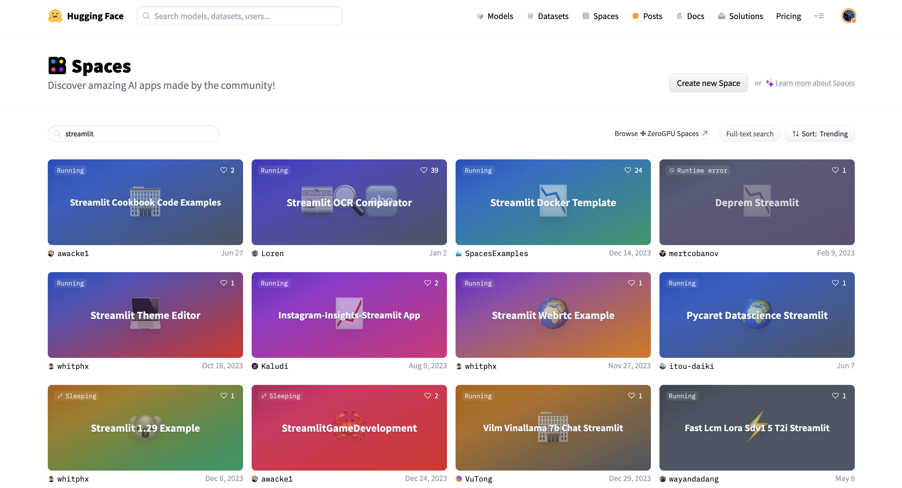

## Altair

```javascript

brush = alt.selection_interval(encodings=['x','y'])

chart1 = alt.Chart(mobility_url).mark_rect().encode(
    alt.X("Student_teacher_ratio:Q", bin=alt.Bin(maxbins=10)),
    alt.Y("State:O"),
    alt.Color("count()")
).properties(
   height=400
).add_params(
        brush
)

chart2 = alt.Chart(mobility_url).mark_bar().encode(
    alt.X("Mobility:Q", bin=True,axis=alt.Axis(title='Mobility Score')),
    alt.Y('count()', axis=alt.Axis(title='Mobility Score Distribution'))
).transform_filter(
    brush
)

chart = (chart1.properties(width=300) | chart2.properties(width=300))

chart
```

notes:
just some reminders for what we worked on last time -- mostly with altair and making some initial dashboards

---

## Altair in Streamlit (in HuggingFace & Jekyll)

```javascript

brush = alt.selection_interval(encodings=['x','y'])

chart1 = alt.Chart(mobility_url).mark_rect().encode(
    alt.X("Student_teacher_ratio:Q", bin=alt.Bin(maxbins=10)),
    alt.Y("State:O"),
    alt.Color("count()")
).properties(
   height=400
).add_params(
        brush
)

chart2 = alt.Chart(mobility_url).mark_bar().encode(
    alt.X("Mobility:Q", bin=True,axis=alt.Axis(title='Mobility Score')),
    alt.Y('count()', axis=alt.Axis(title='Mobility Score Distribution'))
).transform_filter(
    brush
)

chart = (chart1.properties(width=300) | chart2.properties(width=300))

chart
```

How can we share our creations with the public?

notes:
so we can make some cool things but how can we share them with our audience?

we'll discuss how to do this with Streamlit (and later Jekyll)

---

## Streamlit

[Streamlit](https://streamlit.io/) is a way to write "apps" in a Python script that can be hosted on the web.


notes:
where we see a simple example from the video linked above showing how Markdown as a string in Python is translated into headers and text on a page.

---

## HuggingFace

[HuggingFace](https://huggingface.co/) is the platform that we'll be using to host our interactive apps.


notes:
have folks heard of huggingface?

huggingface is a place where folks can share code/datasets and also host apps 

You got a brief intro to huggingface in Lab 6!

---

## Spaces on HuggingFace

We will make use of [Streamlit "Spaces"](https://huggingface.co/spaces?sort=trending&search=streamlit) on HuggingFace to host our apps.



---

## Streamlit in HuggingFace

We'll learn how to build Altair visualizations like [this IS445 Demo](https://huggingface.co/spaces/jnaiman/is445_demo).

notes:
**go to this page!!!**

---

## VSCode to develop apps

We'll be using a new interface on PrairieLearn to develop code: VSCode


---

## VSCode to develop apps


notes: 
you'll see now a brow VSCode workspace option for in class activities

---

## VSCode to develop apps


If you want to install locally:
* Install VSCode: https://code.visualstudio.com/download
* Install local conda environment: https://uiuc-ischool-dataviz.github.io/is445_bcubcg_fall2024/week01/installation_instructions.html


notes: 
if you want to install locally you'll have to figure out two steps

---

## VSCode to develop apps


If you want to install locally:
* Install VSCode: https://code.visualstudio.com/download
* Install local conda environment: https://uiuc-ischool-dataviz.github.io/is445_bcubcg_fall2024/week01/installation_instructions.html

We don't expect you to do any of this!  You can just use the VSCode workspaces provided for you on PrairieLearn.


notes: 
but we don't actually expect you to do this! you can use the VSCode workspaces spaces on PrarireLearn that already have the packages installed

---

## To Streamlit in Python!